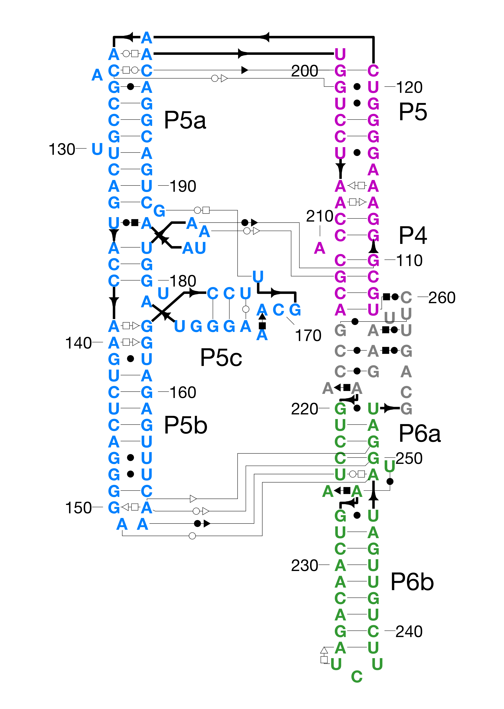
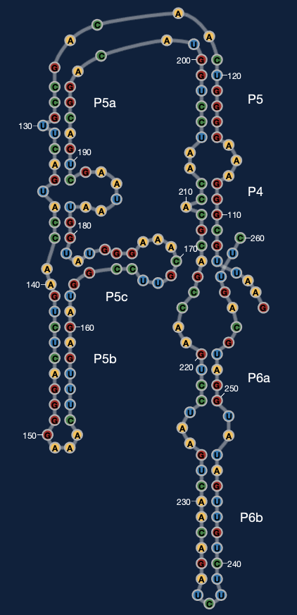

# RiboDraw
Semiautomated layout of RNA tertiary structure diagrams

_(C) Rhiju Das, Stanford University, 2017-2019_

Please e-mail questions to `ribokit.info@gmail.com`

## Getting Started
### Installation of RiboDraw
Ribodraw has been tested on MATLAB R2016a and MATLAB 2017b. 
Some functionality makes use of the Mapping Toolbox and maybe other Toolboxes.

Download RiboKit either by cloning this repository:
```
git clone https://github.com/RiboKit/RiboDraw.git 
```
or check for the latest release at:
```
https://github.com/RiboKit/RiboDraw/releases
```

Then add the `RiboDraw/scripts/` directory  to your MATLAB path using the command `pathtool` or `Set path...` from the menu. Make sure to use the option to include all subdirectories.

### Rosetta
You'll need Rosetta's `rna_motif` executable to extract information on sequence, secondary structure, noncanonical pairs, motifs, etc. Grab the latest release at [RosettaCommons](https://www.rosettacommons.org/software) and follow the installation instructions at [RosettaCommons](https://www.rosettacommons.org/docs/latest/build_documentation/Build-Documentation). Alternatively, you can run a `rna_motif` job via the [rna_info](https://rosie.rosettacommons.org/rna_info) ROSIE server.

### Tutorial
Follow the [**Tutorial**](tutorial/tutorial.md), which teaches you how to make a nice layout of the P4-P6 domain of the *Tetrahymena* group I self-splicing intron:



It takes about 30 minutes (or more, depending on how much you want to refine the drawing).

A brief account of key steps in the tutorial is [](http://www.youtube.com/watch?v=gLcxN6HxEjQ "available on YouTube").

### Eterna
It is also possible to use RiboDraw to generate `customLayout`'s for Eterna puzzles -- this is a preliminary solution for conveying 3D information and resolving overlaps in ribosome-scale problems in Eterna. Here's an example for P4-P6, 



available in this [drawing](drawings/P4P6/1gidA_drawing_eterna.mat), and how this looks inside Eterna at the [Eterna P4-P6 development puzzle](http://eternadev.org/game/puzzle/9386179/). Special information on using Ribodraw to prepare Eterna puzzles is available at [eterna_tutorial.md](tutorial/eterna/eterna_tutorial.md).

## Documentation
### Documentation
Documentation of all MATLAB source code is compiled into HTML format at [docs](scripts/docs/menu.html). It doesn't directly display in GitHub (yet), but if you open this README.md on your local machine, double click on [scripts/docs/menu.html](scripts/docs/menu.html)

### Format
The core format for RiboDraw 'drawing' files was originally JSON-like to allow for eventual reading and writing with versions of RiboDraw in other languages or other kinds of software, but MATLAB's tools to read/write JSON are currently very slow. The fields are described [here](drawing_format.md). The format can therefore also be saved to `.mat` MATLAB workspace files, which are very fast to read/write. Drawings can be exported to `.png`, `.jpg`, `.ps`, and `.pdf` format for manipulation with other software.


## For developers
* *Ribodraw is Open Source*. Want to improve RiboKit's MATLAB interface? Port to JavaScript? Check out our [Issues page](https://github.com/ribokit/RiboDraw/issues) on GitHub. Feel free to fork and make pull requests. 
* *Running unit tests* Go to `RiboDraw/unittests` and type `runtests`. Add your own tests to [RiboDrawTest.m](unittests/RiboDrawTest.m)
* *Its easy to generate HTML docs* We are currently using M2HTML to quickly generate docs for MATLAB scripts. . Download it [here](https://www.artefact.tk/software/matlab/m2html/), and run the
`generate_ribodraw_docs` command in MATLAB to update docs.
