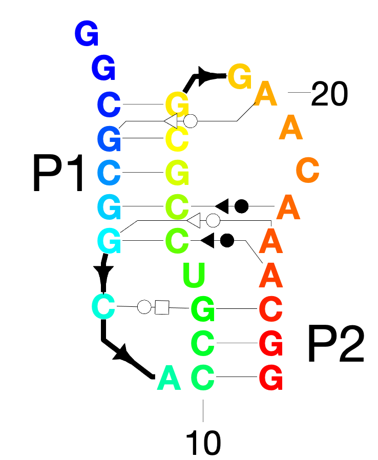
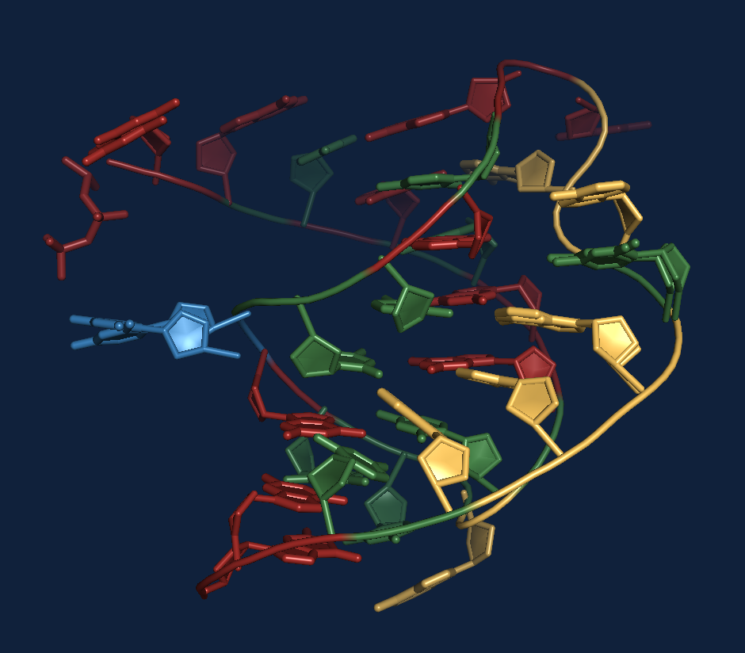
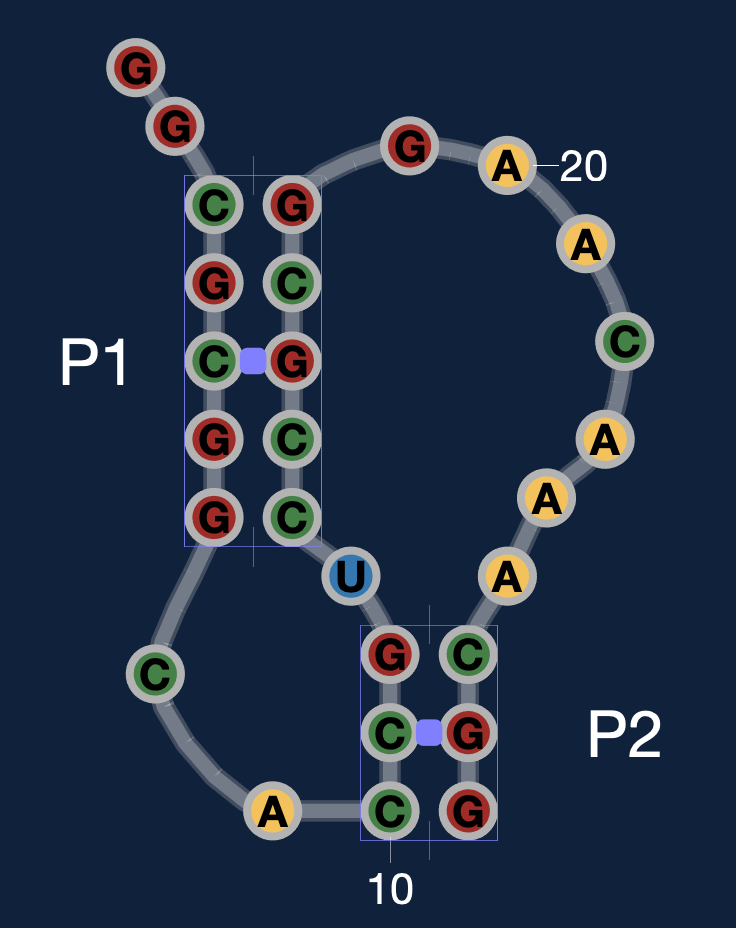
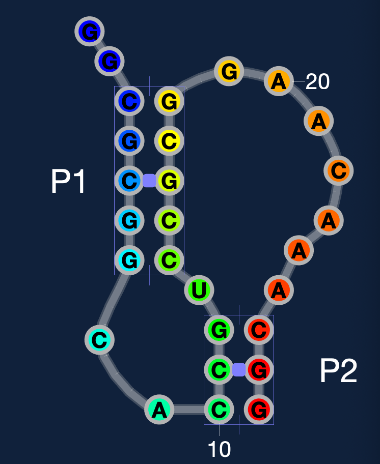
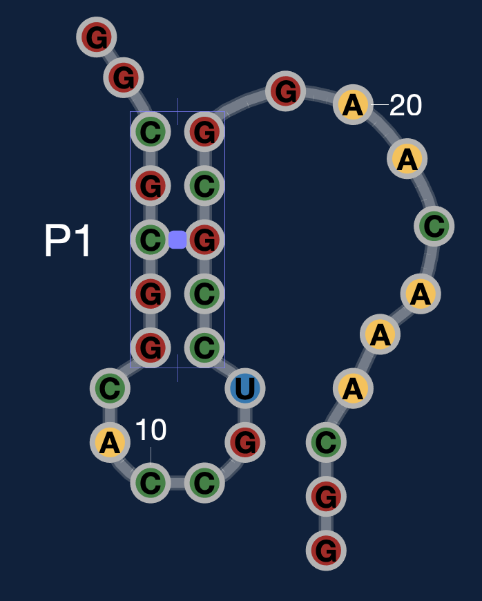
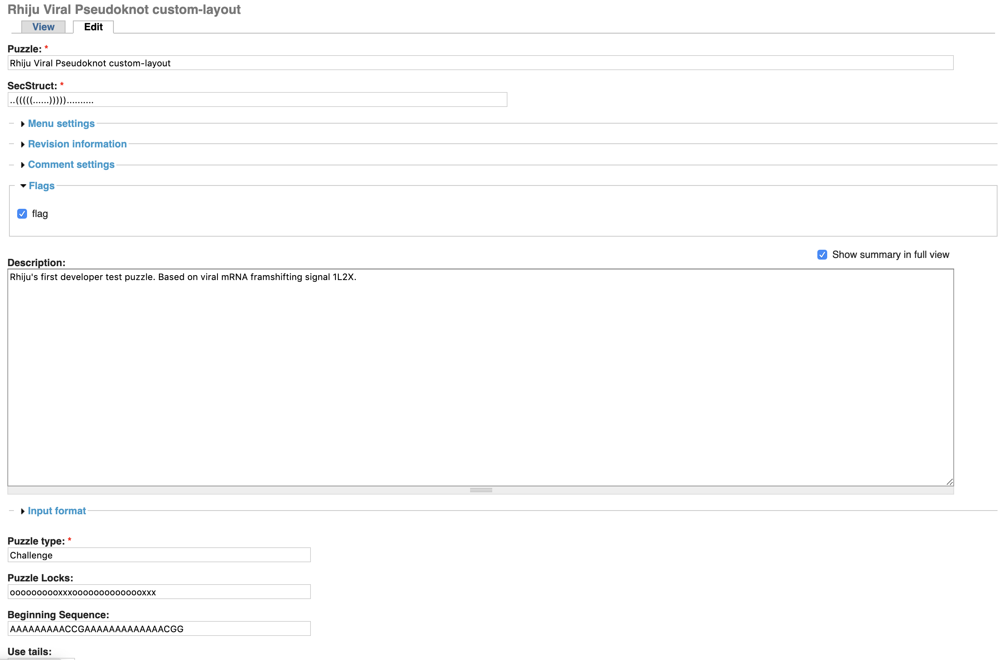
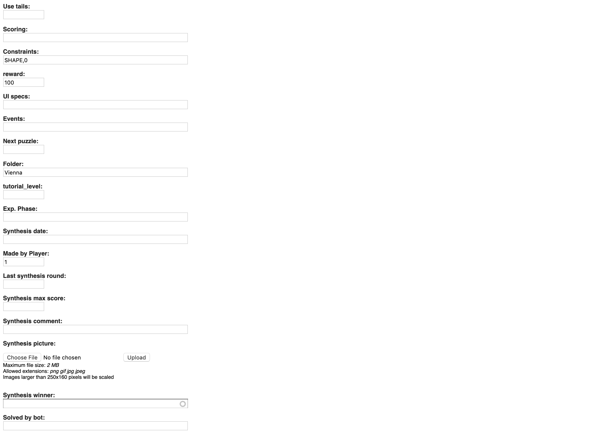
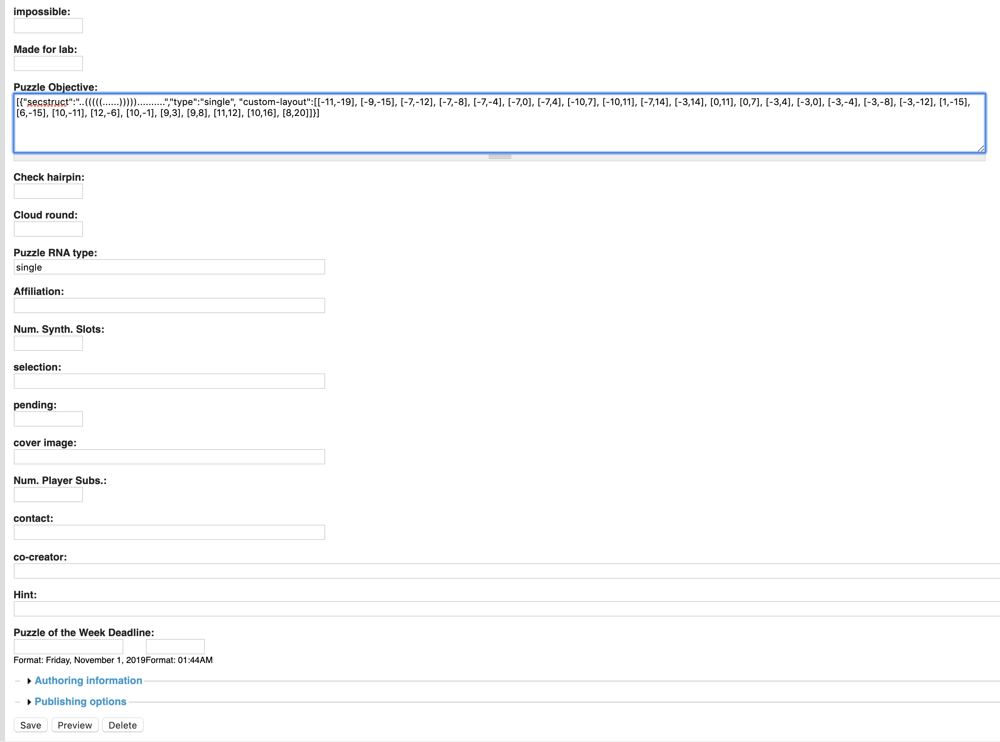
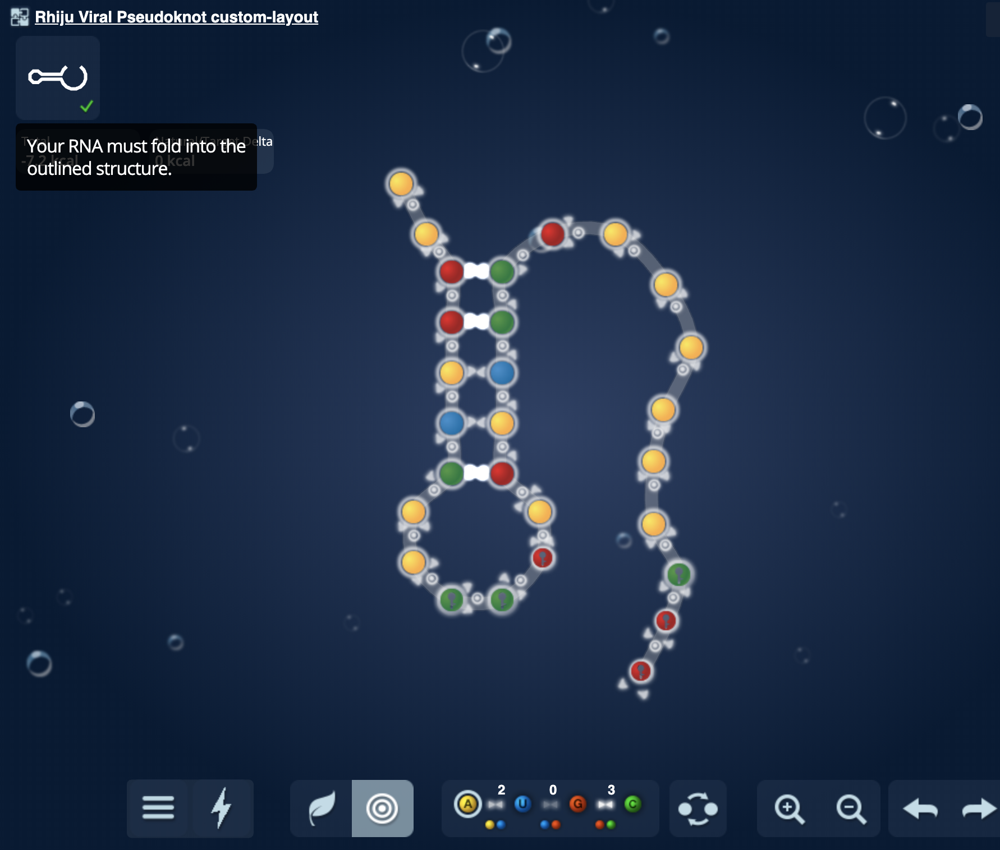

# Tutorial: CustomLayouts for Eterna 
_(C) Rhiju Das, Stanford University, 2019_

Please e-mail questions to `ribokit.info@gmail.com`


## Goal

This tutorial aims to show you how to use RiboDraw code to start with a 3D RNA structure and prepare the sequence, secondary structure, and customLayout that would produce a nice Eterna puzzle. 

Note that you'll eventually need access to Eterna's administrative interface which allows direct editing of puzzle JSON's -- talk to the Eterna developer team. (In the future, Eterna will expose those editing tools to advanced players and/or implement RiboDraw style layout editing within Eterna's puzzle maker.)

Instead of using the P4-P6 RNA, we'll use a viral pseudoknot, PDB ID: [1L2X](https://www.rcsb.org/structure/1l2x), also available in this  directory (`tutorial/eterna`) as `1l2x.pdb`.
 
If you just want to skip ahead and check out an example of the final result, there are example output files in [example_output/](example_output) you can load in the drawing in MATLAB with:

```
load_drawing('example_output/1l2x_eterna.mat');
```

If you get stuck at particular steps, you can also load in intermediate drawings with the `load_drawing` command and the drawing workspaces saved in [example_output/workspaces/](example_output/workspaces)

## Before you start the tutorial
You'll need to already be familiar with RiboDraw. Check out the [getting started](../../README.md) page for RiboDraw & Rosetta installation instructions, and the main [tutorial.md](../tutorial.md) to understand basic manipulations in RiboDraw.


## Let's do this

### Step 1. Convert your drawing to eterna_theme.

Some important things to note

  - Eterna assumes that the distance between consecutive nucleotides  is the same as the distance between base paired nucleotides. That's different from RiboDraw's default spacings where base paired nucleotides have 2x separation of consecutive nucleotides, so those spacings are changed with `set_eterna_theme`.
  - Don't spend much time optimizing the linkers for noncanonical pairs, helix labels, domain labels, or residue number labels (ticks) which also will not show up in EternaJS. If you really want some organized noncanonical pairs at the end, you can use `show_noncanonical_pairs` and `autotrace_noncanonical_pair_linkers`, but remember that those symbols and lines are not going to be transferrable to graphics showing up in playable puzzles in EternaJS.
  - Don't spend much time optimizing arrows between linkers, which are replaced with an automatically updating `baseRope` connector in Ribodraw's Eterna mode, and also will not transfer into EternaJS which will also show a `baseRope`. 

#### If you do not have a drawing...
Follow the instructions in [tutorial.md](../tutorial.md), but type

```Matlab
set_eterna_theme
```
after `initialize_drawing` and before doing the layout. See hints above about not bothering to optimize some graphical elements like linkers for noncanonical pairs.

#### If you already have a drawing...
 Maybe you have a drawing already using Ribodraw's 'default theme'. In that case, load it in

```Matlab
load_drawing 1l2x_original_drawing.mat
```



Then run:

```Matlab
set_eterna_theme
set_artboards
```


### Step 2. Adjust the layout 

```Matlab
hide_noncanonical_pairs
show_helix_controls
```
Note that the helix control features will not get output in the final image. (And you can hide them at any time with `hide_helix_controls`)

It can be very helpful here to bring up a PyMOL window with the PDB file. Setup PyMOL with the [RiboVis software](https://github.com/ribokit/RiboVis) and from your Terminal command line, type

```
pymol 1l2x.pdb
```

Then, inside PyMOL, type:

```
render_eterna()
```

or, for short, `re()`. You should get a view of the 3D structure with eterna-mimicking coloring, like this:



Try to make your MATLAB figure window look like this:



For more complex RNA folds, like ribosomal domains, it can be useful to color the 3D PyMOL view and the RiboDraw view with rainbow coloring (changing from blue to red as the RNA chain goes 5' to 3'). You can get that coloring in Pymol with the command `rf()` and in RiboDraw (MATLAB) with `color_drawing rainbow`:



And you can revert to eterna colors in PyMOL with the command `re()`  and in RiboDraw (MATLAB) with `color_drawing eterna`.

### Step 3. Resolve pseudoknots

You can actually now export the layout to Eterna, with the command:

```Matlab
export_eterna()
```

However, you need to be careful here. Eterna currently doesn't really model  pseudoknots or show them as base pairs, and the above command strips out pseudoknots. However, you probably should be cognizant of -- and specify -- which helices are considered part of the secondary structure and which ones are not (called 'long range stem pairs' in RiboDraw). The above command will issue a suggestion for a pseudknot to convert to a long range stem pair

```
WARNING! WARNING! Found a pseudoknot! Will be ignored in secstruct!!

Consider converting pseudknot to a long range stem with the command:
 convert_helix_to_long_range_stem_pairs( 'Helix_A10');
```
 
The tag `Helix_A10` specifies the helix whose first residue is chain `A` and residue `10` (labeled P2 in the image above). If you run the conversion script, 
 
```Matlab
convert_helix_to_long_range_stem_pairs( 'Helix_A10');
```

you'll see base pair lines disappear for that helix. Based on some initial trials, Eterna developers felt it was confusing for the strands to remain in a 'pseudo' helical configuration when no base pairs will be rendered or modeled in the EternaJS interface. You can therefore move the residues around by hand to make the segments look more 'loopy'. 

In this case, you may also want to try a new command that automatically takes apical loops (the loop for P1 is such a loop) and makes them into circles like in the default Eterna layout:

```Matlab
draw_circular_junction
```

It would also be nice to have similar smart rendering scripts for other kinds of junctions, but those aren't coded up yet.

Try to make the helices look like this


Now is a good time to save our work. All the information in the drawing can be output with

```Matlab
save_drawing( 'drawing_eterna_theme.mat' );
```

And can be read back in later with

```Matlab
load_drawing( 'drawing_eterna_theme.mat' );
```

### Step 4. Get info for your Eterna puzzle

Type:

```Matlab
export_eterna()
```

You should get:

```
Copy this secstruct into puzzle maker:

 ..(((((......)))))..........


Copy this sequence into puzzle maker:

 GGCGCGGCACCGUCCGCGGAACAAACGG


After saving puzzle maker puzzle, edit puzzle via admin.
Paste following into Puzzle-objective JSON:

, "custom-layout":[[-11,-19], [-9,-15], [-7,-12], [-7,-8], [-7,-4], [-7,0], [-7,4], [-10,7], [-10,11], [-7,14], [-3,14], [0,11], [0,7], [-3,4], [-3,0], [-3,-4], [-3,-8], [-3,-12], [1,-15], [6,-15], [10,-11], [12,-6], [10,-1], [9,3], [9,8], [11,12], [10,16], [8,20]]


In puzzle editor, copy this lock-string into locks:

 oooooooooooooooooooooooooooo
```

You can edit the starting sequence from the above, or the lock string (with `x` to mark locked bases) if you wish.

Note that the custom layout is just a set of (x,y) coordinates for each residue. They are integers here because RiboDraw snaps residues and helices to a grid, and the `export_eterna` command centers coordinates on the same grid and then scales the coordinates to be integral spacings. If you see non-integral values, that's fine too, but you can get to all integers if you nudge all the residues/helices in the drawing a bit.

Now you can add or edit an actual Eterna puzzle, using, e.g.  `http://eternadev.org/node/add/puzzle`

As an example of how to fill out the fields for the puzzle, you can check out the pseudoknot puzzle at [http://eternadev.org/node/9386151/edit](http://eternadev.org/node/9386151/edit). Here are screenshots of what that looks like (in case the puzzle above is over-written in the database or you don't yet havem access):






And the playable puzzle [http://eternadev.org/game/puzzle/9386151/](http://eternadev.org/game/puzzle/9386151/) should end up looking like this:

